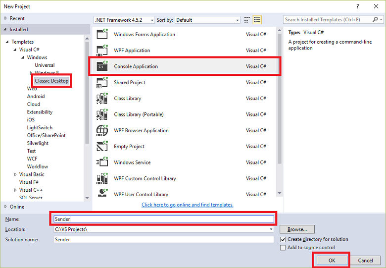

## <a name="send-messages-to-event-hubs"></a>Enviar mensagens para Hubs de evento

Nesta seção, você vai escrever um aplicativo de console do Windows que envia eventos a seu Hub de evento.

1. No Visual Studio, crie um novo projeto de aplicativo de área de trabalho do Visual c# usando o modelo de projeto de **Aplicativo de Console** . Nome do **remetente**do projeto.

    

2. No Solution Explorer, clique com botão direito a solução e clique em **Gerenciar pacotes NuGet para solução**. 

3. Clique na guia **Procurar** , procure `Microsoft Azure Service Bus`. Certifique-se de que o nome do projeto (**remetente**) está especificado na caixa de **versões** . Clique em **instalar**e aceite os termos de uso. 

    

    Visual Studio downloads, instalações e adiciona uma referência para o [pacote do NuGet de biblioteca de barramento de serviço do Azure](https://www.nuget.org/packages/WindowsAzure.ServiceBus).

4. Adicione o seguinte `using` instruções na parte superior do arquivo **Program.cs** :

    ```
    using System.Threading;
    using Microsoft.ServiceBus.Messaging;
    ```

5. Adicione os campos a seguir para a classe de **programa** , substituindo os valores de espaço reservado com o nome do Hub do evento que você criou na seção anterior e a cadeia de conexão do nível de namespace que salva anteriormente.

    ```
    static string eventHubName = "{Event Hub name}";
    static string connectionString = "{send connection string}";
    ```

6. Adicione o seguinte método à classe **programa** :

    ```
    static void SendingRandomMessages()
    {
        var eventHubClient = EventHubClient.CreateFromConnectionString(connectionString, eventHubName);
        while (true)
        {
            try
            {
                var message = Guid.NewGuid().ToString();
                Console.WriteLine("{0} > Sending message: {1}", DateTime.Now, message);
                eventHubClient.Send(new EventData(Encoding.UTF8.GetBytes(message)));
            }
            catch (Exception exception)
            {
                Console.ForegroundColor = ConsoleColor.Red;
                Console.WriteLine("{0} > Exception: {1}", DateTime.Now, exception.Message);
                Console.ResetColor();
            }

            Thread.Sleep(200);
        }
    }
    ```

    Este método continuamente envia eventos para seu Hub de evento com um atraso de 200-ms.

7. Finalmente, adicione as seguintes linhas para o método **principal** :

    ```
    Console.WriteLine("Press Ctrl-C to stop the sender process");
    Console.WriteLine("Press Enter to start now");
    Console.ReadLine();
    SendingRandomMessages();
    ```
