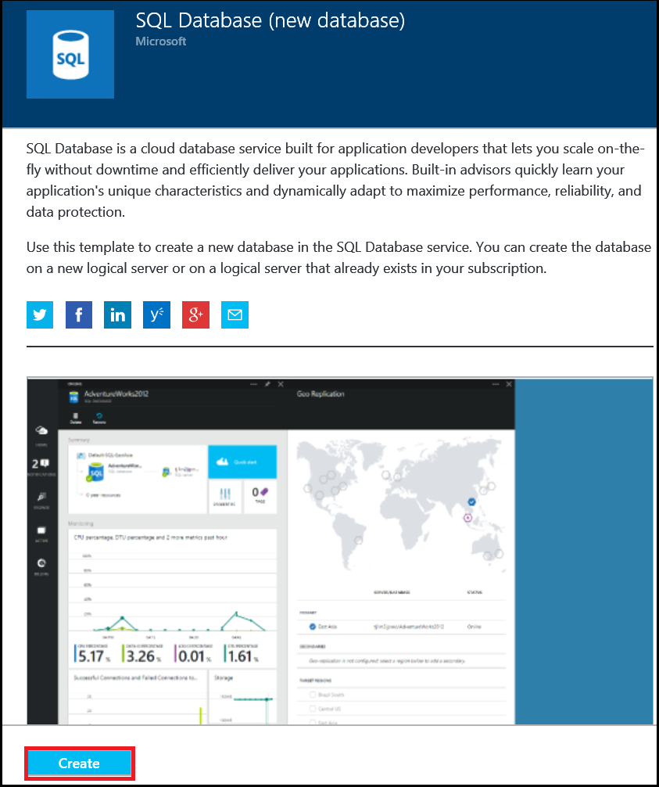
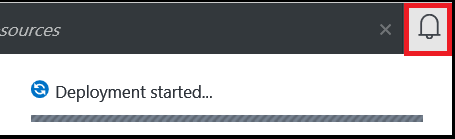

<!--
includes/sql-database-create-new-database-portal.md

Latest Freshness check:  2016-04-11 , carlrab.

As of circa 2016-04-11, the following topics might include this include:
articles/sql-database/sql-database-get-started-tutorial.md

-->
## Criar um novo banco de dados do SQL Azure

Use as etapas a seguir no portal do Azure para criar um novo banco de dados do SQL Azure em um servidor de lógica de banco de dados do Azure SQL novo ou existente.

1. Se você ainda não estiver conectado, conecte o [portal do Azure](http://portal.azure.com).
2. Clique em **novo**, digite o **Banco de dados SQL**e, em seguida, clique em **Banco de dados do SQL (novo banco de dados)**.

     

3. Clique em **Banco de dados do SQL (novo banco de dados)**.

     

4. Clique em **criar** para criar um novo banco de dados no serviço de banco de dados SQL.

     

5. Forneça os valores para as seguintes propriedades do servidor:

 - Nome do banco de dados
 - Assinatura: Isso se aplica somente se você tiver várias assinaturas.
 - Grupo de recursos: se você está começando a, use o grupo de recursos do servidor lógico.
 - Selecione fonte: você pode escolher um banco de dados em branco, dados de exemplo ou um backup do banco de dados Azure. Para migrar um banco de dados do SQL Server local ou carregar dados usando a ferramenta de linha de comando BCP, consulte os links no final deste artigo.
 - Servidor: Um servidor novo ou existente lógico.
 - Logon de administrador do servidor
 - Senha
 - Nível de preços: se você está começando a, use o valor padrão S0.
 - Agrupamento: Isso se aplica somente se um banco de dados em branco foi escolhido.

        

6.  Clique em **criar**. Na área de notificação, você pode ver que iniciou uma implantação.

     

7. Aguarde para implantação concluir antes de prosseguir para a próxima etapa.

     
