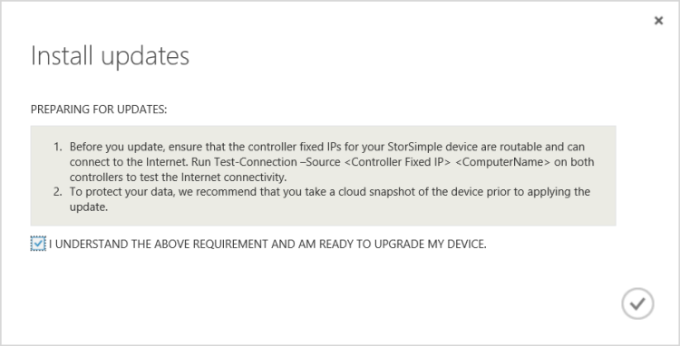

<!--author=SharS last changed: 01/15/2016-->

#### Para instalar o atualização 1.2 do portal clássico do Azure

1. Na página serviço StorSimple, selecione seu dispositivo. Navegue até **dispositivos** > **manutenção**.

2. Na parte inferior da página, clique em **Verificar atualizações**. Um trabalho será criado para verificar se há atualizações disponíveis. Você será notificado quando o trabalho concluído com êxito.

3. Na seção **Atualizações de Software** na mesma página, você verá que novas atualizações de software estão disponíveis. Recomendamos que você examine as notas de versão antes de aplicar 1.2 de atualização em seu dispositivo.

    

4. Na parte inferior da página, clique em **Instalar atualizações**.

5. Você será solicitado para confirmação. Clique em **Okey**.

6. Uma caixa de diálogo **Instalar atualizações** será apresentada. Seu dispositivo deve satisfazer as verificações listadas na caixa de diálogo. Estas etapas foram concluídas antes da atualização. Selecione **para entender o requisito acima e estou pronto para atualizar meu dispositivo**. Clique no ícone de seleção.

    

7. Um conjunto de pré-verificações de automáticas iniciará agora. Eles incluem:

    - **Verificações de integridade de controlador** para verificar se os dois controladores de dispositivo são íntegra e online.
    
    - **Verificações de integridade do componente de hardware** para verificar se todos os componentes de hardware no seu dispositivo de StorSimple são íntegros.
    
    - **Verificações de dados 0** para verificar se os dados 0 são habilitados em seu dispositivo. Se essa interface não estiver ativada, você precisará ativá-lo e tente novamente.
    
    - **Verificações de dados 2 e 3 de dados** para verificar que interfaces de rede de dados 2 e 3 de dados não estão habilitadas. Se essas interfaces estiverem habilitadas, em seguida, você precisará desabilitá-las e, em seguida, tente atualizar seu dispositivo. Essa verificação é executada somente se você estiver atualizando de um dispositivo executando o software de GA. Dispositivos que executam versões 0.1, 0.2 ou 0,3 não serão necessário essa verificação.
    
    - O **gateway verificar** em qualquer dispositivo executando uma versão antes da atualização 1. Essa verificação é executada no dispositivo executando pré-atualização 1 o software, mas falha nos dispositivos que têm um gateway configurado para uma interface de rede diferente de dados 0.
 
    Atualização 1.2 será aplicada somente se todas as verificações de pré-atualização acima são concluídas com êxito. Você será notificado se pré-atualização verificações estão em andamento.
  
    

    A seguir é um exemplo em que a verificação de pré-atualização falhou. Você precisa verificar se os dois controladores de dispositivo são íntegra e online. Você também precisa verificar a integridade dos componentes de hardware. Neste exemplo, controlador de 0 e 1 de controlador componentes precisa de atenção. Talvez seja necessário entrar em contato com o Microsoft Support se você não consegue resolver esses problemas sozinho.

     

    > [AZURE.NOTE] Depois que você aplicou 1.2 de atualização em seu dispositivo de StorSimple, verificações de dados 2 e 3 de dados e a verificação de gateway não será mais necessários para atualizações futuras. As outras pré-verificações ainda será necessárias.

8. Após as verificações pré-atualização são concluídas com êxito, será criado um trabalho de atualização. Você será notificado quando o trabalho de atualização é criado com êxito.
 
    

    A atualização será aplicada, em seguida, em seu dispositivo.
 
9. Para monitorar o andamento do trabalho de atualização, clique em **Exibir trabalho**. Na página de **trabalhos** , você pode ver o progresso da atualização. 

    

10. A atualização levará algumas horas para ser concluída. Você pode exibir os detalhes do trabalho a qualquer momento.

    

11. Após concluir o trabalho, navegue até a página de **manutenção** e role até **Atualizações de Software**.

12. Verificar se o seu dispositivo está executando **StorSimple 8000 série atualização 1.2 (6.3.9600.17584)**. A **última data de atualização** também devem ser modificadas.

    

13. Agora, você verá que atualizações de modo de manutenção estão disponíveis. Essas atualizações são interrupções atualizações que resultam em tempo de inatividade do dispositivo e só podem ser aplicadas por meio da interface do Windows PowerShell do seu dispositivo. Siga as instruções em [instalar atualizações do modo de manutenção](storsimple-update-device.md#install-maintenance-mode-updates-via-windows-powershell-for-storsimple) para instalar estas atualizações através do Windows PowerShell para StorSimple.

> [AZURE.NOTE] Em determinadas circunstâncias, a mensagem indicando que as atualizações de modo de manutenção estão disponíveis pode ser exibida para 24 horas após as atualizações de modo de manutenção com êxito são aplicadas no dispositivo.  

