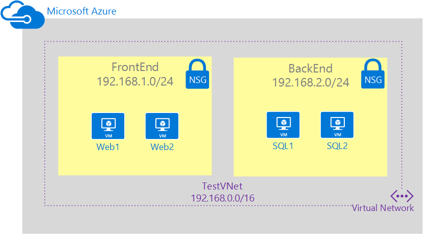

## Cenário

Para ilustrar melhor como criar NSGs, este documento usará cenário abaixo.

Neste cenário, você irá criar um NSG para cada sub-rede na rede virtual **TestVNet** , conforme descrito a seguir: 

- **NSG-FrontEnd**. O front-end NSG será aplicado à sub-rede *FrontEnd* e contêm duas regras:  
    - **regra de rdp**. Essa regra permitirá o tráfego RDP à sub-rede *FrontEnd* .
    - **regra na web**. Essa regra permitirá o tráfego HTTP à sub-rede *FrontEnd* .
- **NSG-back-end**. Back-end NSG será aplicado à sub-rede *back-end* e contêm duas regras: 
    - **regra de sql**. Essa regra permite o tráfego SQL somente da sub-rede *FrontEnd* .
    - **regra na web**. Esta regra nega que todo internet acoplado tráfego da sub-rede *back-end* .

A combinação dessas regras criar um cenário semelhante DMZ, onde a sub-rede de back-end só pode receber tráfego de entrada para SQL da sub-rede front-end e não tem acesso à Internet, enquanto a sub-rede de front-end pode comunicar-se com a Internet e receber solicitações HTTP de entrada somente.
 
